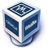
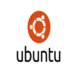

# Deliverable 1 Submission

## Basic Terminology

### What is a web server?
A web server is a computer that stores web server software and a website's component files.

### What is Apache?
Apache is an open source web server, similar to Ubuntu, that operates across various operating system, including Windows and UNIX.

### What are some example web server applications?

| Application Name | License            | Project's Website                           |
| ---------------- | ------------------ | ------------------------------------------- |
| Example 1        | NGINX              | [example 1](https://www.nginx.com/)         |
| Example 2        | Apache License 2.0 | [example 2](https://www.apache.org/)        |
| Example 2        | LiteSpeed          | [example 3](https://www.litespeedtech.com/) |

#### Example 1 - NGINX
 
NGINX is the web server software is designed to handle multiple connections for high traffic sites and demanding environments.

#### Example 2 - Apache
 
Apache is an open source web server, similar to Ubuntu, that operates across various operating system, including Windows and UNIX.

#### Example 3 - LiteSpeed
 
LiteSpeed is a lightweight and security-focused webs server software designed to provide performance and scalability with minimal usage of your server resources.
---
### What is virtualization?
Virtualization is the replication of hardware to stimulate a virtual machine inside a physical machine.

### What is virtualbox?
 
A virtualbox is a powerful type 3 virtualization product for enterprise as well as home use. It runs on Windows, Linux, Macintosh, Solaris

### What is a virtual machine?
A virtual machine is a compute resource that uses software instead of a physical computer to run programs and applications

### What is Ubuntu Server?
 
Ubuntu Server  is a server operating system that allows open source programmers globally.

### What is a firewall?
Firewall is a network security device that monitors traffic to or from your network.

### What is SSH?
Secure Shell(SSH) is a network protocol that gives users a secure way to access a computer over an unsecured network. 

## Concepts I Don't Understand:

* sudo: is a command-line utility for UNix and Unix-based operating systems such as Linux and macOS
  
* systemctl: responsible for examining and controlling the systemd system and service manager
  
* init system:  executed by the kerne; during the booting of a system used to create processes from a script in the file /etc/inittab

* ufw: is a command-line firewall layer that automatically uses iptables as a back-end firewall
  
* virtual host: is a method for hosting multiple domain names on a single server
  
* chown: changes the owner of the files or directory specified by the File or Directory to the user specified by the Owner parameter

* chmod: is used to manage file system permissions on Unix-like systems
  
* nano: command line text editor
  
* a2ensite: enables the specified site with the apache2 configuration 
  
  