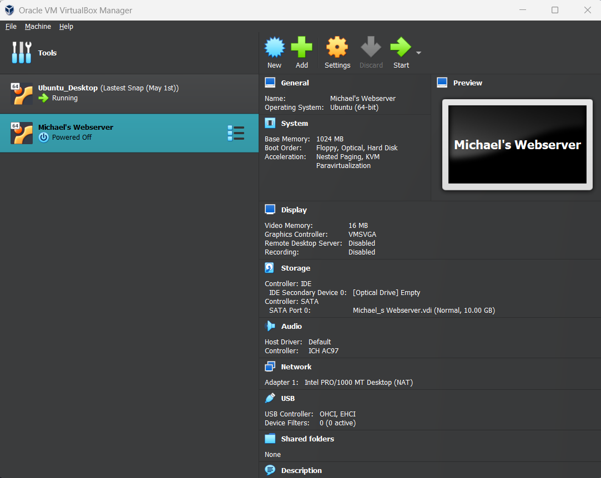
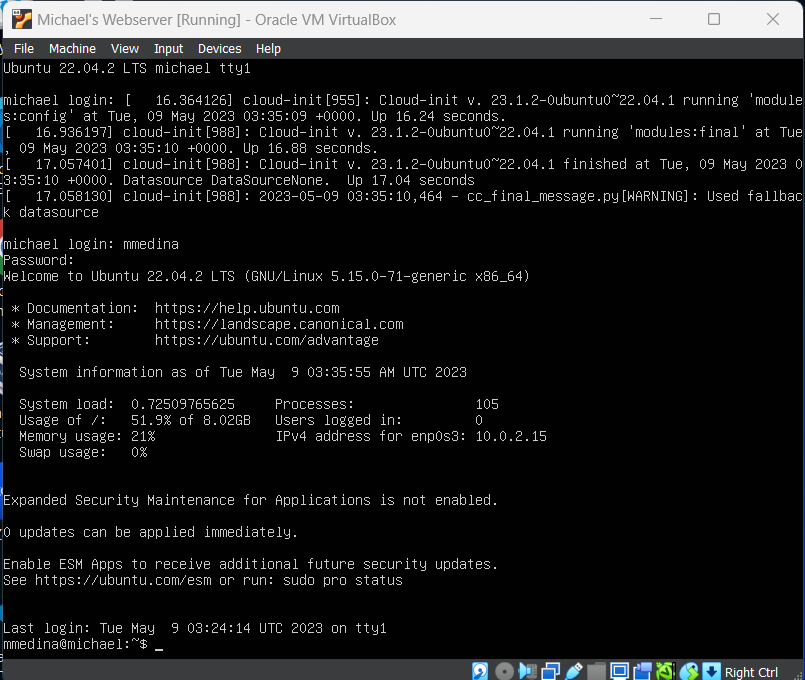

# Deliverable 2 Submission

## VM Hardware

## Login Screen

## Screenshot of the following commands:

1. systemctl status apache2 --no-pager

2. systemctl status sshd --no-pager

3. systemctl status ufw --no-pager

## Screenshots of the last 10 lines of the following log files:
1. Apache: access.log

2. Apache: error.log

3. SSH: auth.log

## Screenshot of the following configuration:
1. sites-available config file
   
2. apache2.conf

## Screenshot of IP Address and Access to Browser

