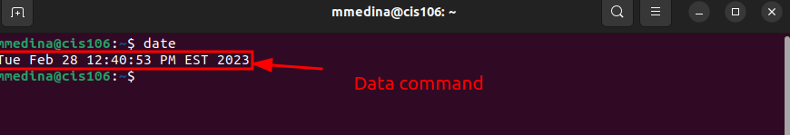
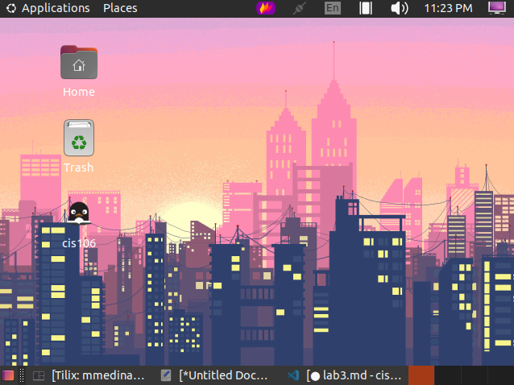

''' 
    Name: Michael Medina
    Course: CIS-106
    Semester: Spring 23
'''

#lab 3 Submission

##Question 1

##Question 2

##Question 3

| Program purpose     | Package Name     | Version            |
| ------------------- | ---------------- | ------------------ |
| Play a tetris game  | blockattack      | 2.7.0-1            |
| Play a video file   | dragonplayer     | 4:21.12.3-0ubuntu1 |
| Browse the internet | epiphany-browser | 42.4-0ubuntu1      |
| Read your email     |                  |                    |
| Play music          |                  |                    |

##Question 4

| command | what it does                                                                                                   |
| ------- | -------------------------------------------------------------------------------------------------------------- |
| echo    | Prints a statement in quotes                                                                                   |
| fortune | Displays a fortune                                                                                             |
| cowsay  | Displays an image of a cow with a message                                                                      |
| lolcat  | Adds rainbow coloring to the text                                                                              |
| figlet  | Displays entered texts into large text created by slashes                                                      |
| toilet  | prints entered texts into a large text with characters                                                         |
| rig     | Displays information such as your name, address,city,state, and phone number within a boy drawn in characters. |
