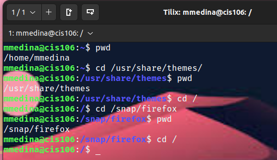
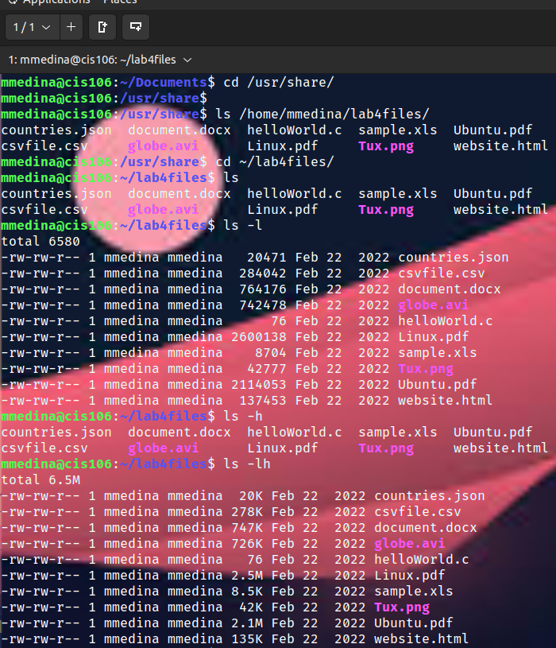
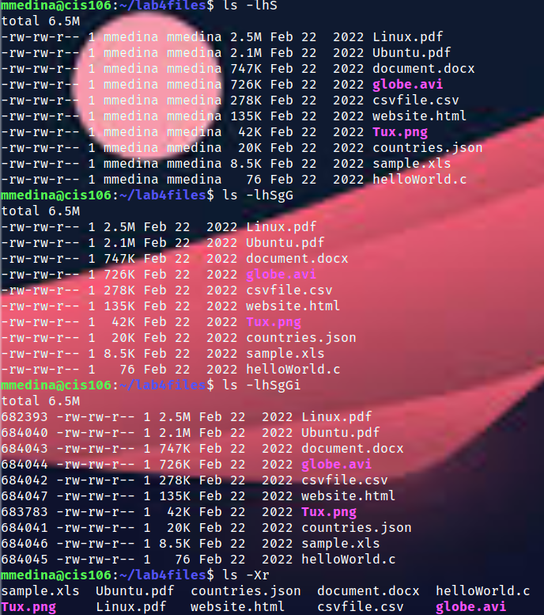
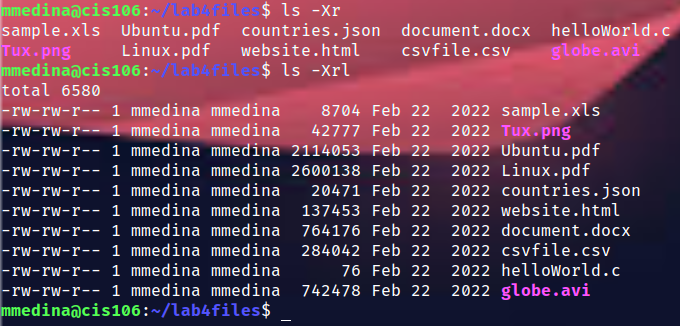
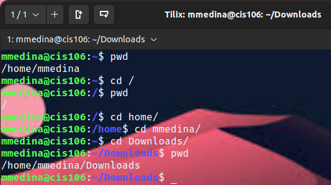
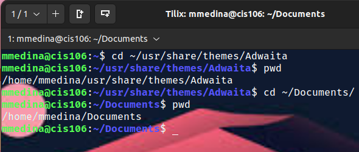

# Lab 4: The Linux FS

## Question 1 

## Question 2

## Question 4
**Open a new terminal. What is your present/current working directory?**
/home/mmedina

**Change your present/current working directory to the default directory located inside /usr**
cd ~/usr/default

**Change your present/current working directory to the ipv4 directory located inside /proc**
cd ~/proc/ipv4

**Change your present/current working directory to the previous present/working directory**
cd -

**List all the files inside share/backgrounds without changing your present working directory.**
ls ~/share/backgrounds

**List all the files inside your cis106 directory located in YOUR home directory.**
ls ~/home/mmedina

**List all the files inside your Downloads directory. Your present working directory has to be /home before your can list all the files.**
ls ~/Downloads/

**Change your present/current working directory to disk/by-id and from there long list all the files in your home directory including hidden files.**
cd ~/disk/by-id; ls -1Ra ~/home

**List all the files sorted by modification time inside the share/themes directory.**
ls -t ~/share/themes

**List all the files sorted by file extension inside the /usr/share directory.**
ls -X ~/usr/share

## Question 5

