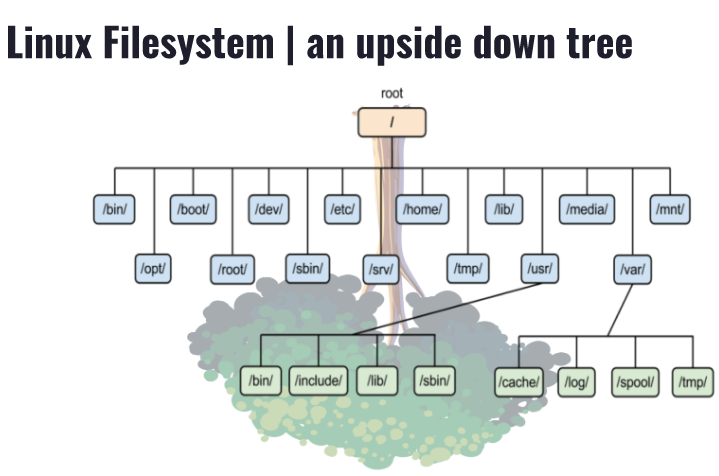

---
    Name: Michael Medina
    Course: CIS-106
    Semester: Spring 23
--- 

# **Week Report 4**

## "The Linux File System" : Practice 

## The Linux File System Directories and Their Purpose:

## Table Of All the Commands for Navigating the Filesystem

| The Command | What The Command Does                             | The Syntax                        | Example                                       |
| ----------- | ------------------------------------------------- | --------------------------------- | --------------------------------------------- |
| ls          | displays the files inside a given directory       | `ls + option + directory to list` | ls book.txt #list books in from the text file |
| cd          | used for changing the current working directory   | `cd + destination`                | cd $HOME #brings you to your home directory   |
| pwd         | used for displaying the current working directory | `pwd`                             | pwd  #command shows /home/mmedina             |