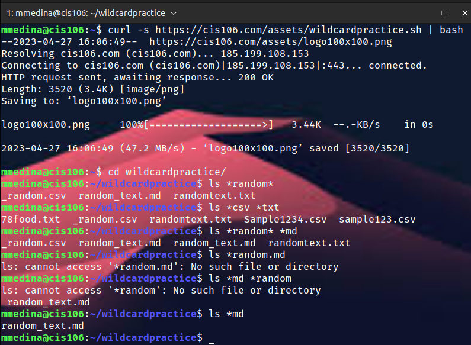
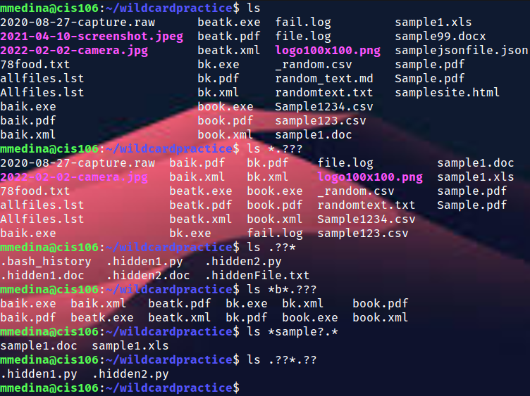
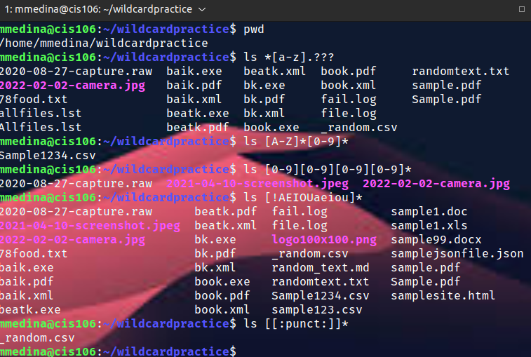

--- 
    Name: Michael Medina
    Course: CIS-106
    Semester: Spring 23
---

## Week Report 6

## Wildcards

### * Wildcard
The * wildcard matches from 0 to any number of characters
* Examples: 
  * List all the text file in a directory
    * `ls*.txt `
  * List all the files that start with the word file 
    * `ls file*`
  * Copy all the mp4 files
    * `cp Downloads/*.mp4 ~/Videos/Movies/`
### ? Wildcard
The ? wildcard matches a single character.
* Examples:
  * List all the file extension with only two letters
    * `ls -1X *.??`
  * List all the file start with the letter b and that ends with the letter k
    * `ls b??k*`
  * List all the files that contain the letter f and l
    * `ls f?l*` 

### [ ] Wildcard 
The [ ] wildcard matches one of multiple character in a filename
* Example
  * List all the file 
    * `ls [a-z]*.???`
  
  * `ls [A-Z]*[0-9]*` 
  
  * `ls [!0-9]*`

### Brace Expansion
Brace expansion {} is not a wildcard but another feature of bash that allows you to generate arbitrary strings to use with commands.
* Example 
  * `mkdir -p music/{jazz,rock}/{mp3files.videos,oggfiles}/new{1..3}`

  * `touch homework{1..5}.txt`
  
  * `rm -r file{1..20}.txt`

### Practice 5

### Practice 6

### Practice 7
