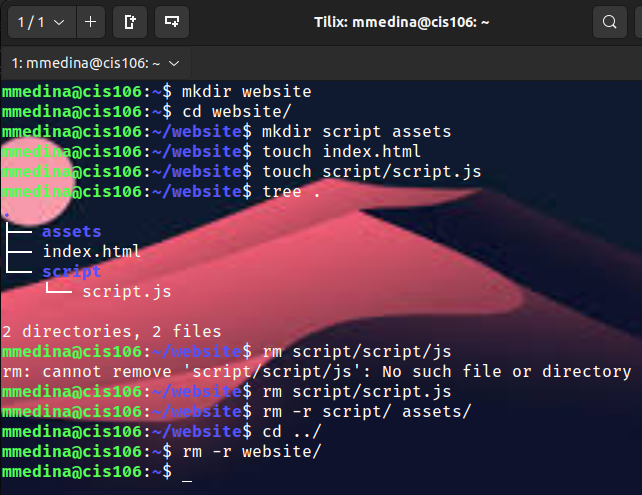
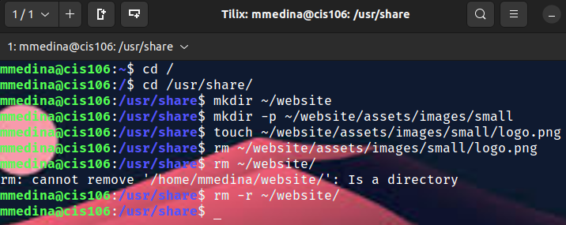
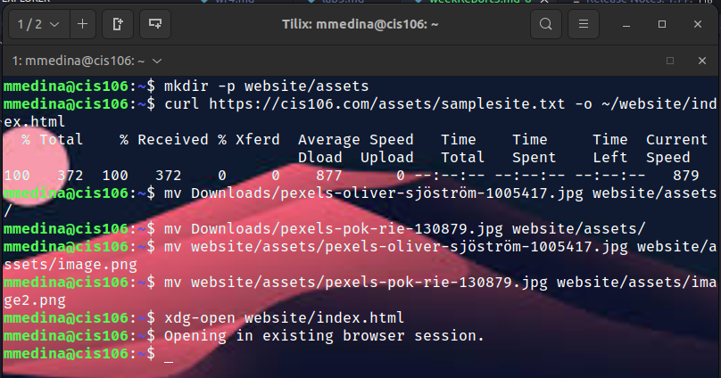
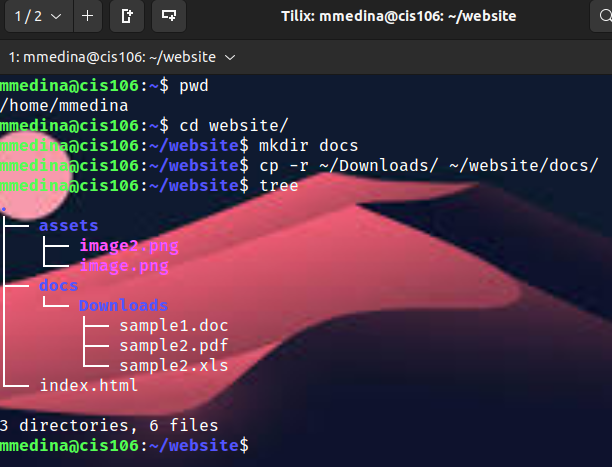

# Week Report 5

## Answer The Questions:

**What are Command Options** 
Commands options are used to modify or enhance a command's behavior.

**What are Command Arguments?**
Command arguments are commands used items open which the command acts on.

**Which command is used for creating directories? Provide at least 3 examples.**
The command is mkdir
* Example 1: mkdir movies
* Example 2: mkdir -p ~/Downloads/games
* Example 3: mkdir picture/beach
    
**What does the touch command do? Provide at least 3**
The command touch creates a file.
* Example 1: touch homework
* Example 2: touch homework1.txt homework2.txt
* Example 3: touch ~/Documents/homework.txt

**How do you remove a file? Provide an example.**
The command is rm 
* Example 1: rm website

**How do you remove a directory and can you remove non-empty directories in Linux? Provide an example.**
To remove an empty directory you must use rmdir. To remove a non-empty directories you use rm -r .
* Example 1: rm -r Downloads/games

**Explain the mv and cp command. Provide at least 2 examples of each**
The mv command allows you to move and rename directories.
* Example 1: mv Documents/resume.doc MyFile/
* Example 2: cp Documents/resume.doc MyFile/

## Practice 1

## Practice 2

## Practice 3

## Practice 4
